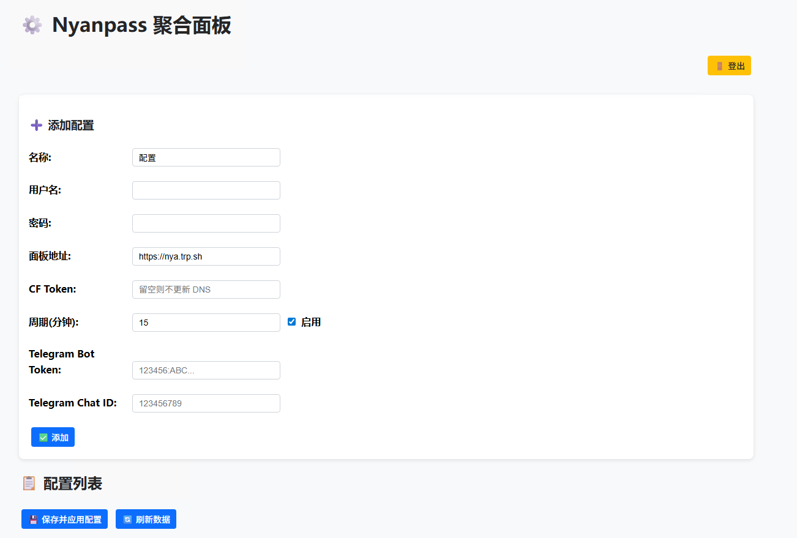
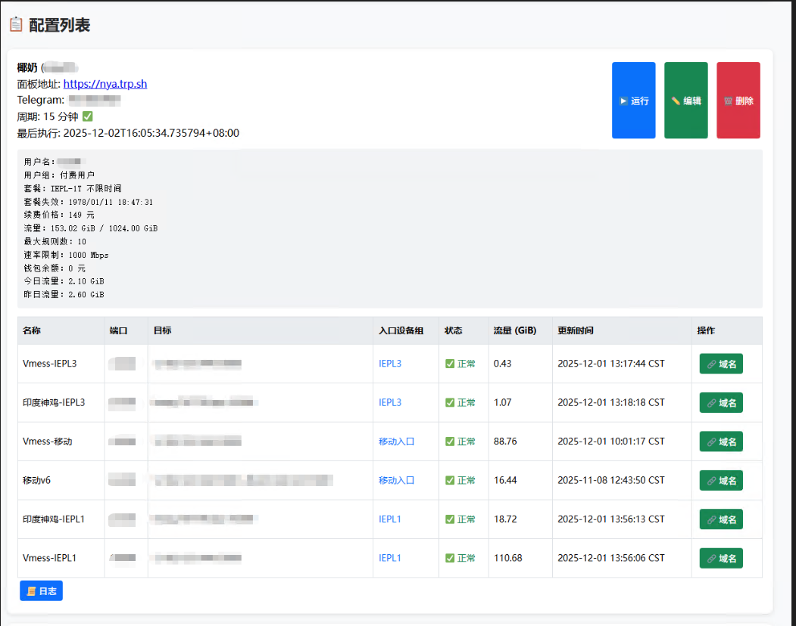
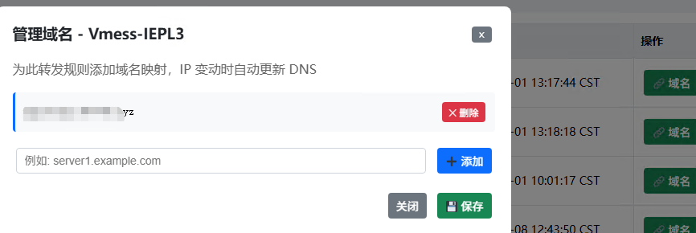
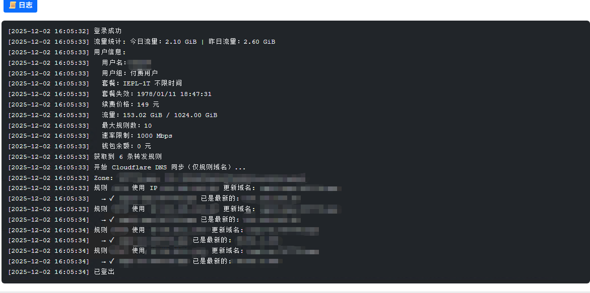

[toc]

# Nyanpass Panel

一个用于监控和管理 Nyanpass 服务的 Web 面板。

## 项目结构

```
├── Dockerfile
├── LICENSE
├── Makefile
├── README.md
├── data
│   └── config.json
├── docker-compose.yml
├── pyproject.toml
├── setup.py
└── src
    ├── main.py
    ├── nyanpass_panel
    │   ├── __init__.py
    │   ├── __pycache__
    │   │   ├── __init__.cpython-311.pyc
    │   │   └── app.cpython-311.pyc
    │   ├── app.py
    │   └── static
    │       └── index.html
    └── requirements.txt
```

## 功能特性

- 自动获取用户信息和流量统计
- 定时任务调度
- Cloudflare DNS 自动更新
- Telegram 通知
- Web 管理界面

## 安装与运行

### 使用 Docker (推荐)

#### 使用 docker-compose (推荐)

```bash
# 构建并启动服务
make compose-up

# 查看日志
make compose-logs

# 停止服务
make compose-down
```
**Note:** 如果没有 `make` 命令或不想使用 `make`，请使用以下命令手动安装并运行：
```bash
# 构建并运行容器
docker compose up -d --build
```

#### 使用传统构建

```bash
# 构建镜像
make docker-build

# 运行容器
make docker-run
```

### 本地运行

#### 使用 Make 命令（推荐）

```bash
# 安装依赖
make install

# 运行应用
make run
```

#### 手动安装运行

```bash
cd src
pip install -r requirements.txt
python main.py
```

访问 http://localhost:5000 登录面板。

默认用户和密码将在首次运行时生成并打印到控制台。
请在 `config.json` 中修改认证信息并重启服务。

## Makefile 命令

### 基础命令
- `make` 或 `make install` - 安装依赖
- `make run` - 运行应用
- `make dev` - 运行开发服务器
- `make test` - 运行测试
- `make lint` - 代码检查
- `make format` - 格式化代码
- `make clean` - 清理构建产物

### Docker 命令
- `make docker-build` - 构建 Docker 镜像
- `make docker-run` - 运行 Docker 容器
- `make docker-up` - 构建并运行 Docker 容器
- `make compose-build` - 使用 docker-compose 构建
- `make compose-up` - 使用 docker-compose 启动服务
- `make compose-down` - 停止 docker-compose 服务
- `make compose-logs` - 查看 docker-compose 日志

- `make help` - 显示帮助信息

## 配置

首次运行会自动生成 `config.json` 配置文件：
```json
{
  "auth": {
    "username": "your_username",
    "password": "your_password"
  },
  "timezone": "Asia/Shanghai",
  "jobs": {}
}
```

## 效果展示
### login 界面


### 主页界面


### 任务管理界面

#### 域名管理界面

#### 日志管理界面


